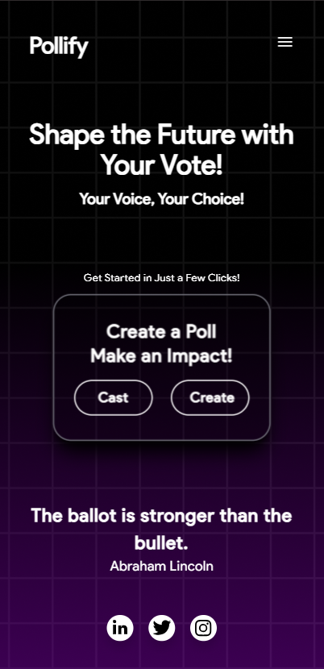

# Pollify Documentation


---

## Overview

Pollify is a dynamic web application designed for seamless poll creation, participation, and real-time result tracking. It combines the power of modern web technologies like **React**, **TypeScript**, and **Appwrite** to deliver an intuitive and efficient user experience.

### Key Features

✨ **Poll Creation**: Effortlessly create polls with multiple options.

✨ **Voting System**: Secure and user-friendly voting interface.

✨ **Real-Time Results**: Live updates of poll results to keep everyone informed.

✨ **Authentication**: Robust user authentication to ensure fair voting.

---

<div style="display: flex; flex-direction: row; align-items: center;">
    
    
</div>

---

## Tech Stack

- **Frontend**: React, TypeScript, TailwindCSS
- **Backend**: Appwrite (for database and user management)
- **Deployment**: Deployed on Vercel

---

## Getting Started

### Prerequisites

Before you begin, ensure you have the following installed:

- Node.js
- pnpm (Install via [pnpm.io](https://pnpm.io/))

### Installation

1. Clone the repository:

    ```bash
    git clone https://github.com/your-username/pollify.git
    ```

2. Navigate to the project directory:

    ```bash
    cd pollify
    ```

3. Install dependencies:

    ```bash
    pnpm install
    ```

4. Start the development server:

    ```bash
    pnpm start
    ```

5. Open your browser and go to:

    ```
    http://localhost:3000
    ```

---

## File Structure

```plaintext
src/
├── App.jsx
├── components/
│   ├── subComponents/
│   │   ├── Navbar.jsx
│   │   ├── PollSubmitted.jsx
│   │   ├── Success.jsx
│   │   ├── Transition.jsx
│   ├── Routes/
│       ├── About.jsx
│       ├── Home.jsx
│       ├── PollCreation.jsx
│       ├── Polls.jsx
│       ├── Result.jsx
│       ├── Tempt.jsx
├── main.jsx
├── Appwrite.ts
├── index.css
├── index.html
├── AppwriteConfig.ts
└── Appwrite.ts
```

---

## Usage

### Creating a Poll

1. Enter your details (name, mobile number, email).
2. Click on **"Create Poll"**.
3. Fill in the poll question and options.
4. Submit the poll.

### Managing Polls

- View all your polls in the **"Polls"** section.
- Check poll details or results.
- Edit polls easily.

---

## Contributing

We welcome contributions! Check out our [CONTRIBUTING.md](CONTRIBUTING.md) for guidelines.

---

## License

This project is licensed under the [MIT License](LICENSE).

---

Made with ❤️ by the Pollify Team.
